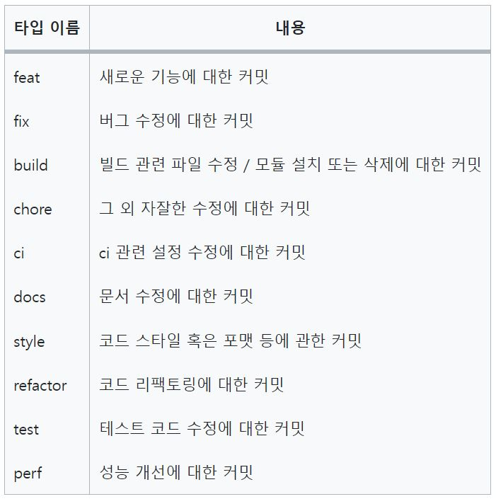

# Frontend 커밋 규칙

### 커밋 메시지의 7가지 규칙
1. 제목과 본문을 빈 행으로 구분한다.
2. 제목은 50글자 이내로 제한한다.
3. 제목의 첫 글자는 대문자로 작성한다.
4. 제목 끝에는 마침표를 넣지 않는다.
5. 제목은 명령문으로 사용하며 과거형을 사용하지 않는다.
6. 본문의 각 행은 72글자 내로 제한한다.
7. 어떻게 보다는 무엇과 왜를 설명한다.

출처 : https://velog.io/@chojs28/Git-%EC%BB%A4%EB%B0%8B-%EB%A9%94%EC%8B%9C%EC%A7%80-%EA%B7%9C%EC%B9%99